# 🔄 Sơ Đồ Luồng Hoạt Động Dự Án

## 📊 Tổng Quan Kiến Trúc

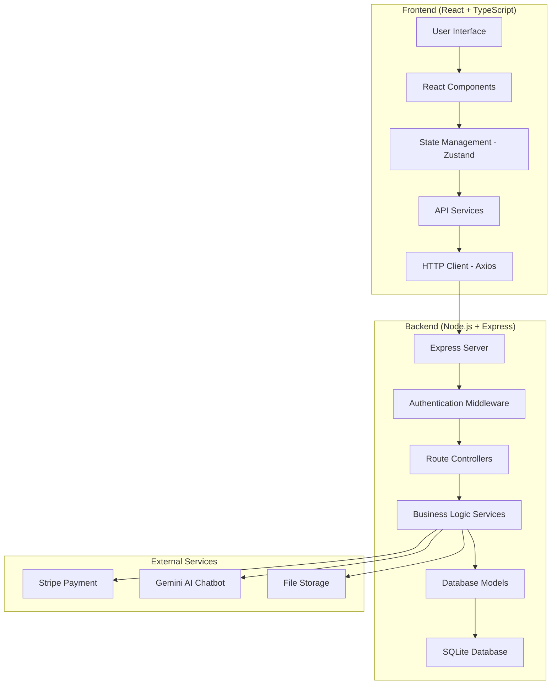

## 🚀 Luồng Hoạt Động Chính

### 1. 👤 Xác Thực Người Dùng

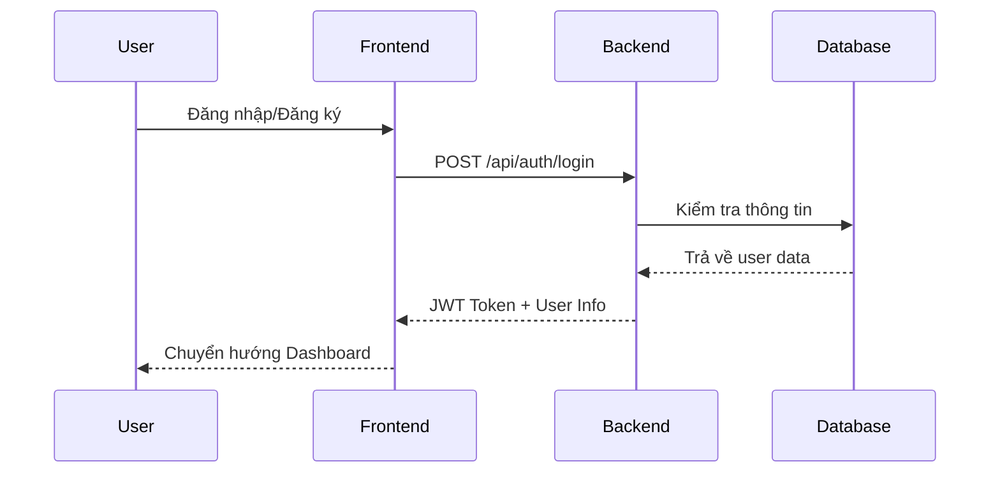

### 2. 🛍️ Quản Lý Sản Phẩm

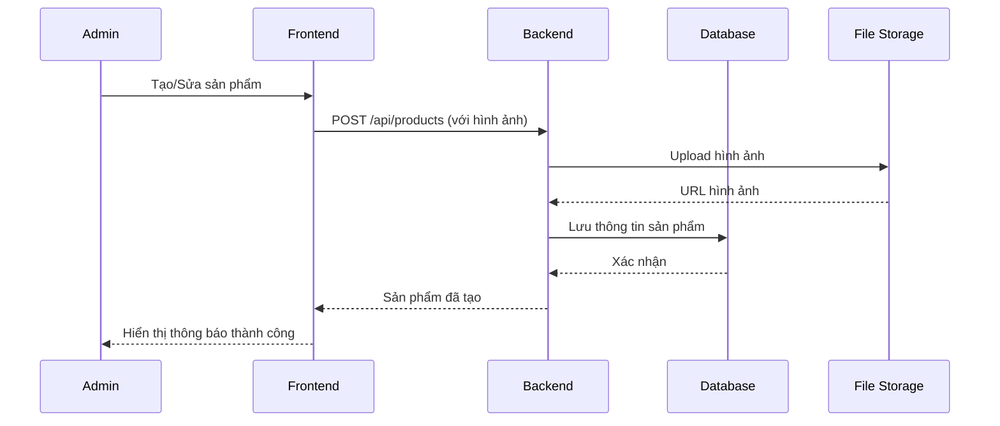

### 3. 🛒 Quy Trình Mua Hàng

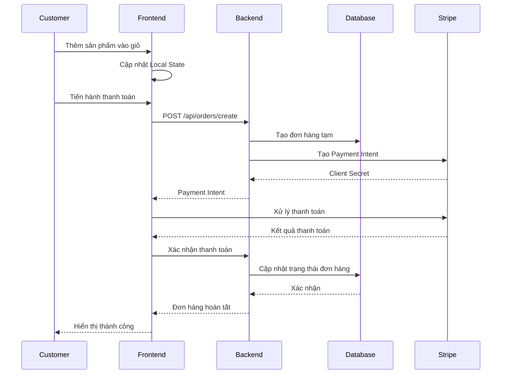

### 4. 🤖 Chatbot Hỗ Trợ

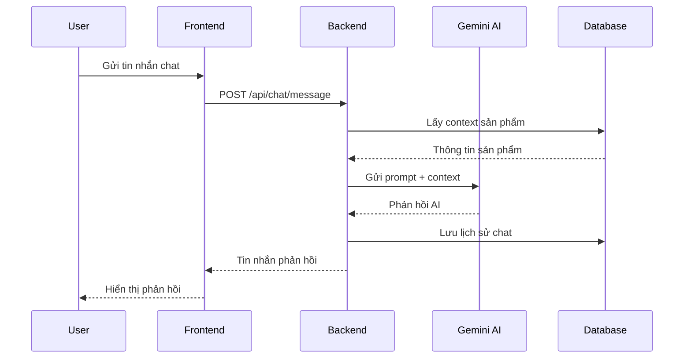

## 🏗️ Kiến Trúc Chi Tiết

### Frontend Architecture

```
src/
├── components/          # UI Components tái sử dụng
│   ├── common/         # Button, Input, Modal...
│   ├── layout/         # Header, Footer, Sidebar
│   └── forms/          # Form components
├── pages/              # Các trang chính
│   ├── auth/           # Login, Register
│   ├── shop/           # Product listing, detail
│   ├── admin/          # Admin dashboard
│   └── checkout/       # Cart, Payment
├── store/              # Zustand state management
├── services/           # API calls
├── hooks/              # Custom React hooks
├── utils/              # Helper functions
└── types/              # TypeScript definitions
```

### Backend Architecture

```
src/
├── controllers/        # Route handlers
│   ├── auth.js        # Authentication
│   ├── products.js    # Product management
│   ├── orders.js      # Order processing
│   └── chat.js        # Chatbot
├── middlewares/        # Express middlewares
│   ├── auth.js        # JWT verification
│   ├── upload.js      # File upload
│   └── validation.js  # Input validation
├── models/            # Database models
├── services/          # Business logic
├── routes/            # API routes
└── utils/             # Helper functions
```

## 🔐 Bảo Mật & Xác Thực

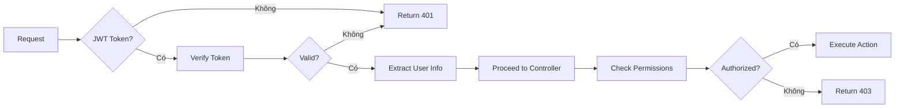

## 📱 Responsive Design Flow

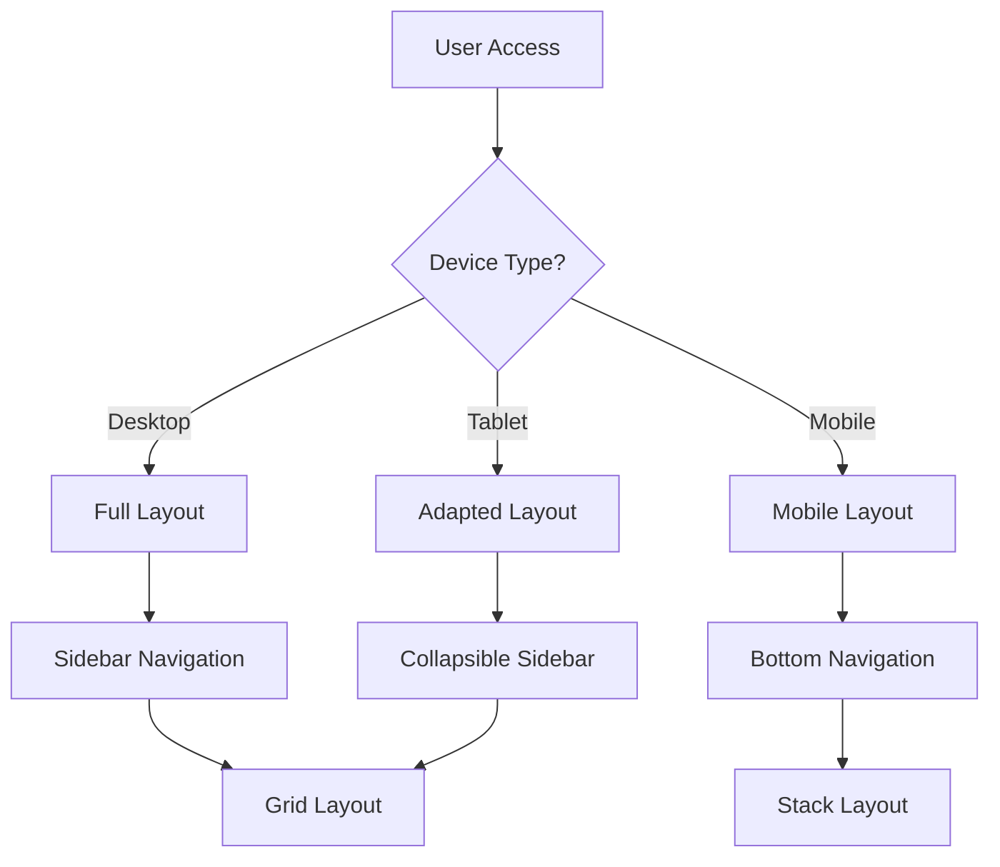

## 🌐 Đa Ngôn Ngữ (i18n)

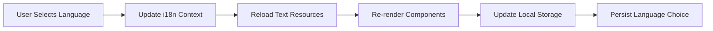

## 📊 Quản Lý Trạng Thái

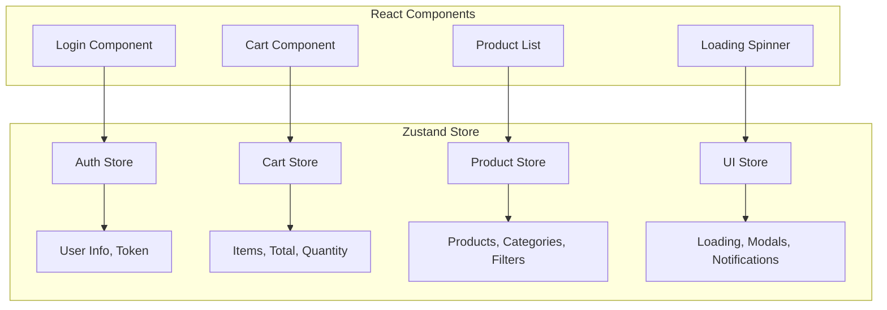

## 🚀 Deployment Flow

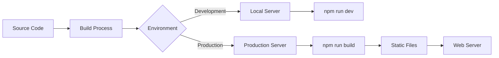

## 📈 Performance Optimization

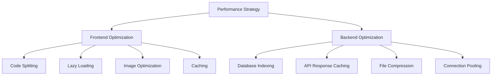

## 🔄 Data Flow Summary

1. **User Interaction** → Frontend captures user actions
2. **State Management** → Zustand manages application state
3. **API Calls** → Frontend communicates with backend via REST API
4. **Authentication** → JWT tokens secure all requests
5. **Business Logic** → Backend processes requests and applies business rules
6. **Database Operations** → SQLite stores and retrieves data
7. **External Services** → Integration with Stripe and Gemini AI
8. **Response** → Data flows back to frontend and updates UI

Sơ đồ này cho thấy dự án được thiết kế với kiến trúc hiện đại, bảo mật cao và dễ mở rộng.
